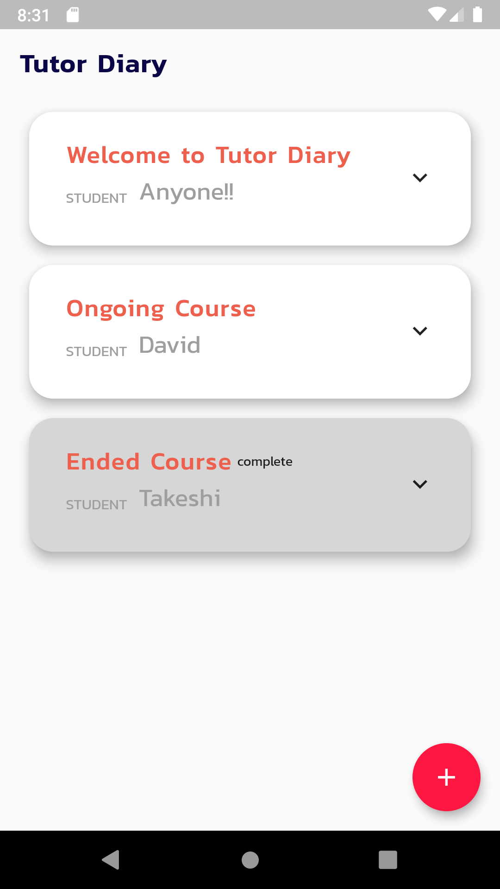
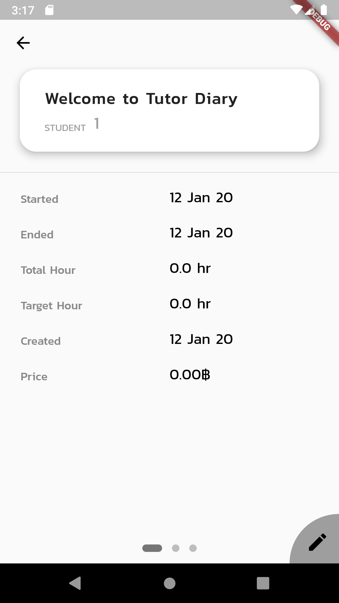
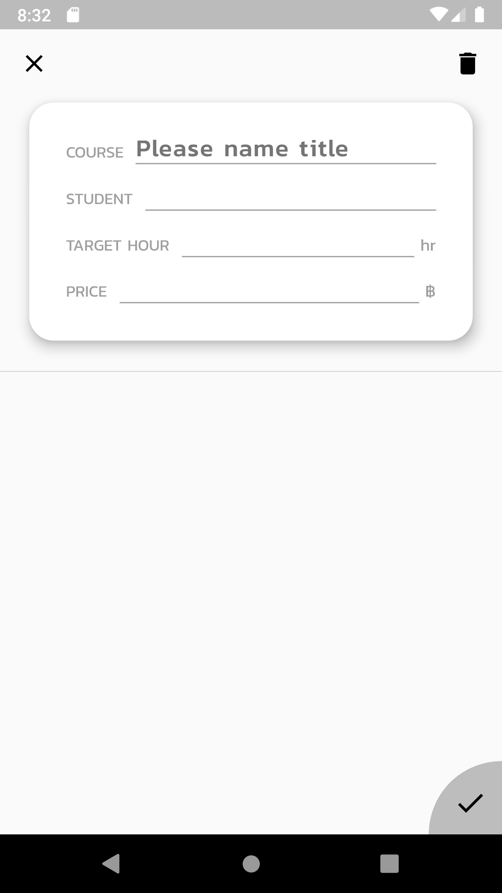
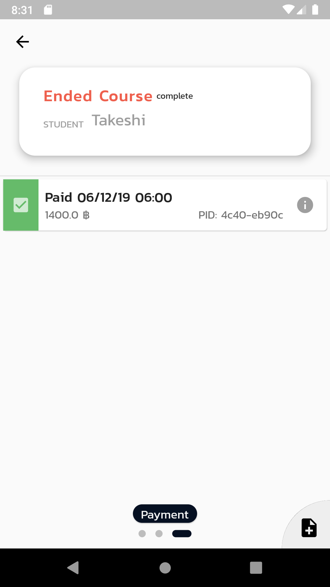
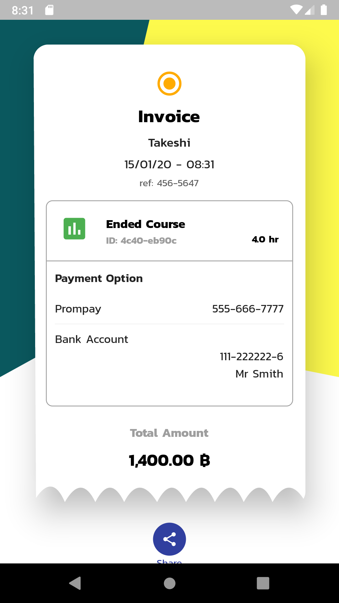
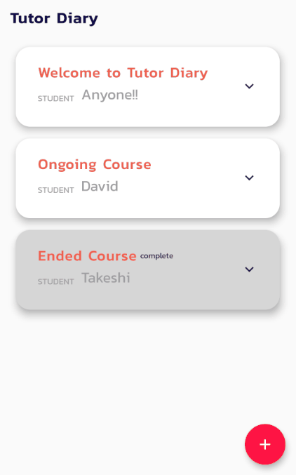

# Tutor Diary

An example for using Flutter to create an diary app for tutor. This app provide a function to record details about their teaching classes and also able to generate an invoice and a reciept. This Flutter app use Bloc state management and have put some animation in the app to increase user experience.

    

